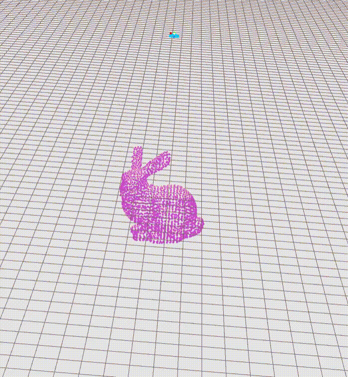
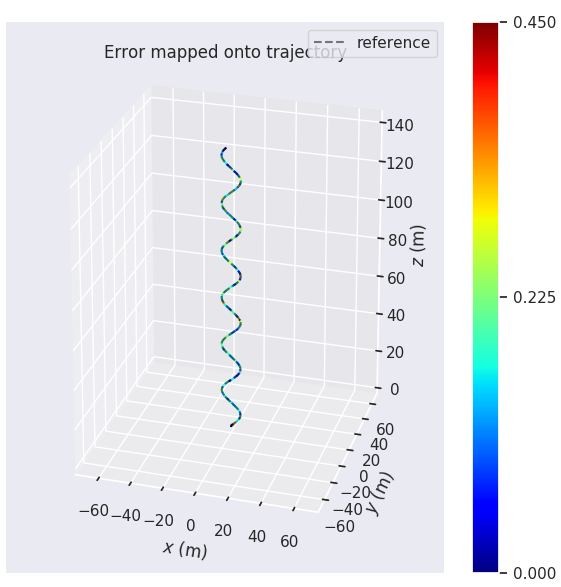
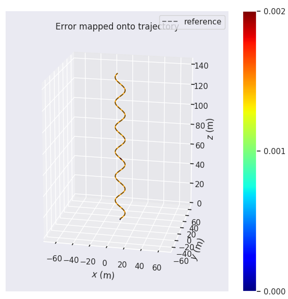
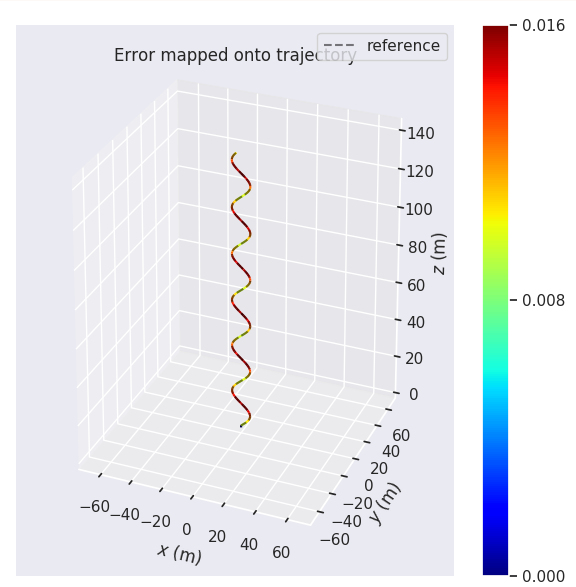
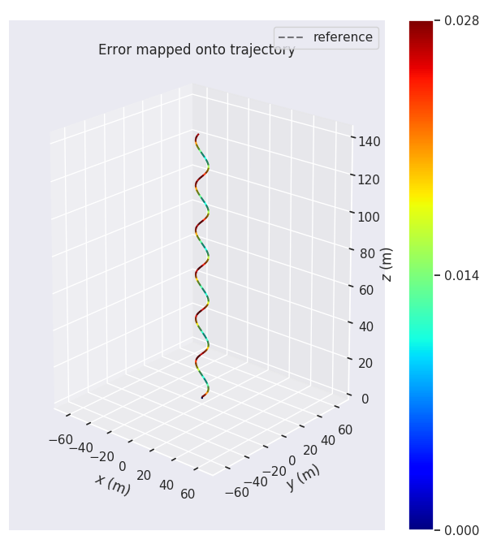

# SFM for Dynamic and Static Objects
**Introduction**

SFM algorithm for both dynamic and static objects.

**Videos:**

***Static Object***

 

***Dynamic Object***

 

<<<<<<< HEAD
<table border="1" width="1440" cellspacing="10">
<tr>
  <th align="center">without_constrain_0.2_pose_noise</th>
  <th align="center">depth_0m_noise</th>
  <th align="center">depth_0.2m_noise</th>
  <th align="center">depth_0.4m_noise</th>
</tr>
<tr>
  <td> </td>
  <td> </td>
  <td> </td>
  <td> </td>
</tr>
<tr>
<td>GT Point Clouds (Puple)</td>
<td rowspan="6" colspan="4" align="center"> </td>
</tr>
<tr>
<td>Noised Point Clouds (Green)</td>
</tr>
<tr>
<td>Optimized Point Clouds (Red)</td>
</tr>
<tr>
<td>Obj GT Traj (Lavender)</td>
</tr>
<tr>
<td>Obj Noised Traj (Red)</td>
</tr>
<tr>
<td>Obj Optimized Traj (Orange)</td>
</tr>
</table>

<!-- [Youtube](https://youtu.be/iQVhdhqFTZQ) -->
=======
[Youtube](https://youtu.be/JXHjTY0kOgw)
