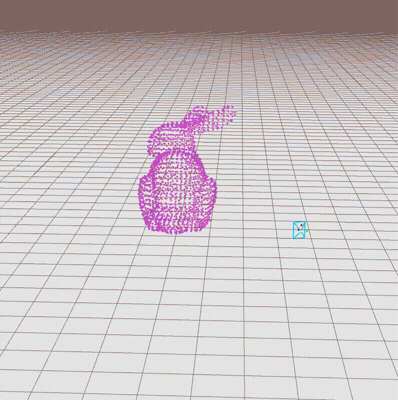

# SFM for Dynamic and Static Objects
**Introduction**

SFM algorithm for both dynamic and static objects.

**Videos:**

***Static Object***

 

***Dynamic Object***

 

[Youtube](https://youtu.be/JXHjTY0kOgw)
